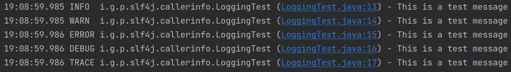
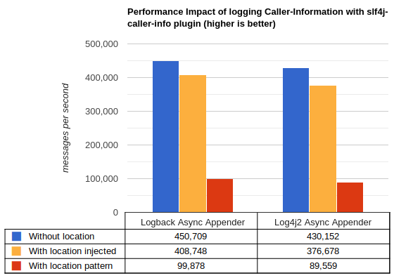
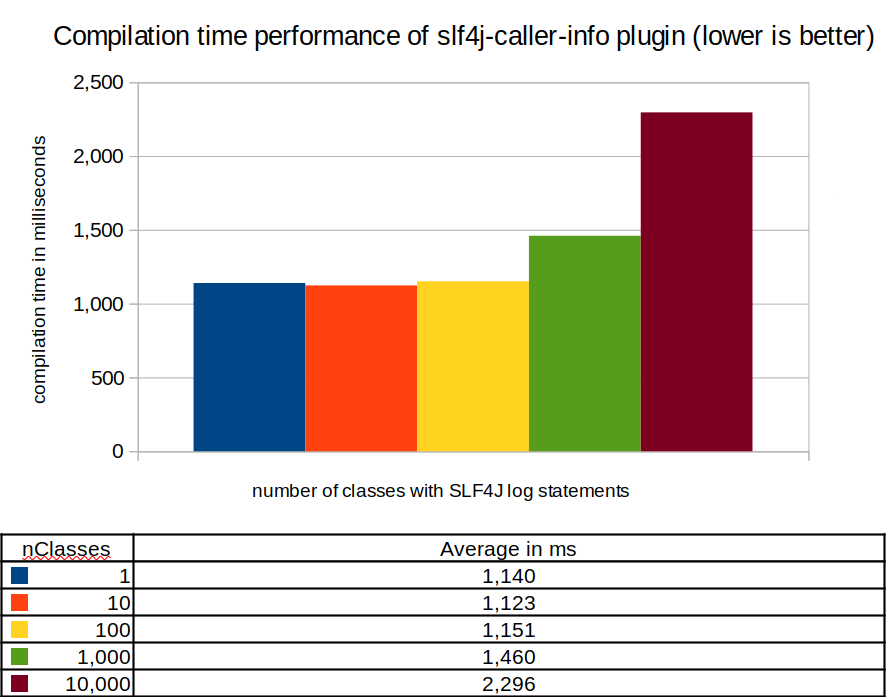

# slf4j-caller-info-maven-plugin
[](https://maven-badges.herokuapp.com/maven-central/io.github.philkes/slf4j-caller-info-maven-plugin)
[](https://snyk.io/test/github/PhilKes/slf4j-caller-info-maven-plugin)
[](./LICENSE)

Maven plugin to **inject caller-location-information** to all [SLF4J Logger](https://www.slf4j.org/api/org/slf4j/Logger.html) log statement invocations (`info()`, etc.) in your compiled code.


## Description
The caller-location-information injection is done with a [MDC.put(...)](https://www.slf4j.org/api/org/slf4j/MDC.html#put-java.lang.String-java.lang.String-) call before every SLF4J log invocation, putting the class name, line number (optionally also method name) into the MDC in the compiled `.class` files. This allows to conveniently **print out where exactly in the code the log statement originates from** for every single log statement, without any overhead or performance loss, by simply adding the **Mapped Diagnostic Context** ([MDC](https://logback.qos.ch/manual/mdc.html)) parameter `callerInformation` to your logging-pattern configuration. It can therefore be used with any SLF4J implementation, such as [logback](https://logback.qos.ch/), [log4j2](https://logging.apache.org/log4j/2.x/), etc.

Since this plugin adds the code before runtime, there is **nearly no performance loss** by injecting the caller-location-information in comparison to using e.g. the `%class` or `%line` pattern parameters (see [Log4j2 manual](https://logging.apache.org/log4j/2.x/manual/layouts.html#Patterns) or [Logback manual](https://logback.qos.ch/manual/layouts.html#class) in your logging pattern, that looks for the caller-information on the stacktrace during runtime which is very costly.

## Usage
Add the plugin to your `pom.xml`:

```xml
<build>
    <plugins>
        <plugin>
            <groupId>io.github.philkes</groupId>
            <artifactId>slf4j-caller-info-maven-plugin</artifactId>
            <version>1.0.0</version>
            <executions>
                <execution>
                    <goals>
                        <goal>inject</goal>
                    </goals>
                </execution>
            </executions>
        </plugin>
    </plugins>
</build>
```
*Note: JDK 8 or higher required*

The plugin is executed in the `process-classes` phase or can be explicitly run with:
```shell
mvn slf4j-caller-info:inject
```

_Note: The `inject` goal is idempotent_

## Code Example
See [logback.xml](./src/it/projects/logback/src/test/resources/logback.xml):
```xml
...
<appender name="CONSOLE" class="ch.qos.logback.core.ConsoleAppender">
    <encoder>
        <!-- Example log pattern including the needed 'callerInformation' MDC parameter -->
        <pattern>%d{HH:mm:ss.SSS} %-5level %logger{36} \(%X{callerInformation}\) - %msg%n</pattern>
    </encoder>
</appender>
...
```
See [LoggingTest.java](./src/it/projects/logback/src/main/java/io/github/philkes/slf4j/callerinfo/LoggingTest.java):
```java
1   package io.github.philkes.slf4j.callerinfo;
2
3   import org.slf4j.Logger;
4   import org.slf4j.LoggerFactory;
5
6   /**
7    * Example Class using an SLF4J Logger on different Levels
8    */
9   public class LoggingTest {
10      private final Logger log = LoggerFactory.getLogger(LoggingTest.class);
11
12      public void log(String msg) {
13          log.info(msg);
14          log.warn(msg);
15          log.error(msg);
16          log.debug(msg);
17          log.trace(msg);
18      }
19  }
```

Log Output of `LoggingTest.log("This is a test message")`:



*(Screenshot from IntelliJ, automatically detects class + linenumber as links to jump directly into the source code)*

## Performance at runtime



As you can see using the `slf4j-caller-info-maven-plugin` (orange bars) printing the caller location is about **4x faster** than using Log4j2's or Logback's caller-location built-in pattern (red bars). In total there is a speed loss of only ~9% for Log4j2 and ~8% for Logback in comparison to not logging the caller-location at all (blue bars).

System specs for the benchmarks:
JDK 17 on Linux Mint 20.3 with 8 cores CPU AMD Ryzen 2700X@3.7Ghz

The benchmarking was done with [JMH](https://github.com/openjdk/jmh) based on log4j's [log4j-perf](https://github.com/apache/logging-log4j2) module.
For more details about the benchmarks see the [benchmark](./benchmark/) module.


### Performance at compiletime
As for the time it takes the `inject` goal to execute, the compilation time of the plugin is evaluated by generating Java projects with n classes, that all contain 5 SLF4J log-statements and running the plugin on these projects and averaging the plugin's execution time.



We can see that the plugin's execution time obviously goes up the more classes and `SLF4J` log statements there are in the source code,
but even for a project with 10,000 classes the compilation time is only ~2 seconds.


### Configuration
There are several parameters you can overwrite:
```xml
<configuration>
<!-- All parameters are optional, the shown default values are used if they are not overwritten in your pom.xml --> 
    <!-- Injection format which can include conversion words: class,line,method -->
    <injection>%class:%line</injection>
    <!-- MDC parameter name for the injection, this parameter has to be present in your logging.pattern ('%X{callerInformation}') -->
    <injectionMdcParameter>callerInformation</injectionMdcParameter>
    <!-- Regex for specifying which packages/classfiles should be injected into -->
    <filterClasses>.*</filterClasses>
    <!-- Specify log levels to be injected to -->
    <levels>TRACE,DEBUG,INFO,WARN,ERROR</levels>
    <!-- Whether or not to print the package-name of the class, if '%class' is present in 'injection' parameter -->
    <includePackageName>false</includePackageName>
    <!-- Target directory which contains the compiled '.class' files -->
    <target>${project.build.outputDirectory}</target>
</configuration>
```

### Compiled .class File of Code Example
```java
// import ...
public class LoggingTest {
    //...
    public void log(String msg) {
        Logger var10000 = this.log;
        MDC.put("callerInformation", "LoggingTest.class:13");
        var10000.info(msg);
        MDC.remove("callerInformation");
        var10000 = this.log;
        MDC.put("callerInformation", "LoggingTest.class:14");
        var10000.warn(msg);
        ...
    }
}
```


## Dependencies
- [ASM](https://asm.ow2.io/) for Java bytecode manipulation
- [Apache Commons IO](https://commons.apache.org/proper/commons-io/) for FileUtils
- Built with Java 17
- [JMH](https://github.com/openjdk/jmh) for benchmarks


This project is licensed under the terms of the [Apache 2.0 license](https://www.apache.org/licenses/LICENSE-2.0.txt).
